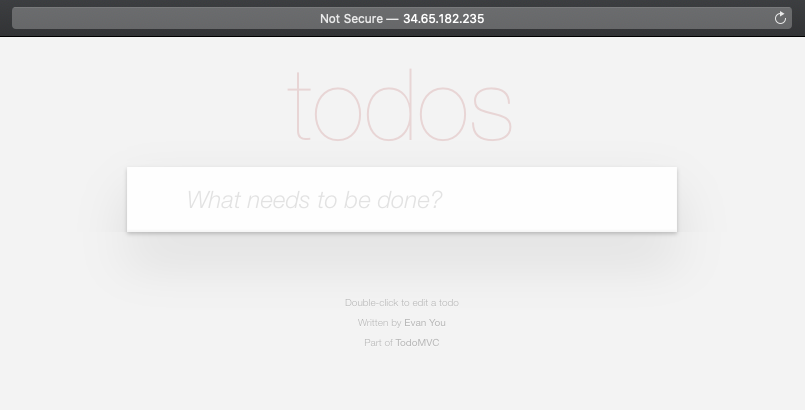
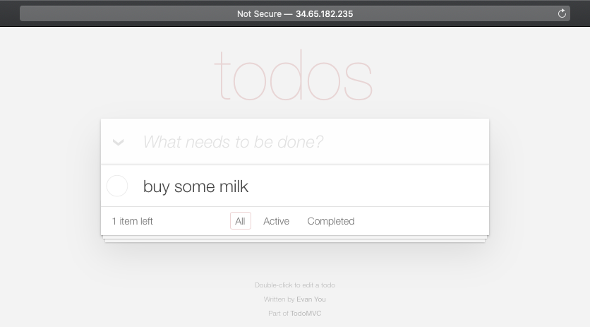

# front-end




## Table of Contents

* [Introduction](#introduction)

* [Getting Started](#getting-started)

* [Prerequisites](#prerequisites)

    * [Install Node.js](#install-node-js)

    * [Install npm packages](#install-go-tools)

    * [GitLab Variables](#gitlab-variables)

    * [Pipeline](#pipeline)

* [Testing](#testing)

* [Deployment](#deployment)

* [Helm](#helm)

* [Dockerfile](#dockerfile)

* [Final](#final)
    

## Introduction

It's a [Todo-MVC](http://todomvc.com/) Vue.js project.
It works with `front-end` application.
It has only Cypress Integration tests.

After build stage it runs as a [Docker container](https://www.docker.com/resources/what-container) deployed with [Helm](https://helm.sh/) to GKE Cluster.

## Getting Started

[Vue.js](https://vuejs.org/) is an open-source model–view–viewmodel JavaScript framework for building user interfaces and single-page applications.

[Cypress](https://www.cypress.io/) is fast, easy and reliable testing for anything that runs in a browser.

[Docker](https://www.docker.com/) is a tool designed to make it easier to create, deploy, and run applications by using containers. 

[Helm](https://helm.sh/) is the package manager for Kubernetes. It's simple way for creating Kubernetes object files. (Deployment, Service, ConfigMap etc.) and It's the best way to find, share, and use software built for Kubernetes.

[Google Kubernetes Engine (GKE)](https://cloud.google.com/kubernetes-engine) provides a managed environment for deploying, managing, and scaling your containerized applications using Google infrastructure. The GKE environment consists of multiple machines (specifically, [Compute Engine](https://cloud.google.com/compute) instances) grouped together to form a [cluster](https://cloud.google.com/kubernetes-engine/docs/concepts/cluster-architecture).

## Prerequisites

### Install Node.js

[Download and Install](https://nodejs.org/en/download/) or [Download and Install via Package Manager](https://nodejs.org/en/download/package-manager/)


### Install npm packages

```
npm install --save cypress
npm install --save serve
npm install --save start-server-and-test
```
### GitLab Variables

#### Service Account Key

The **Service Account** named **infra** must be created and **Service Account Key** must be added to **GitLab TodoListApplication Group Variables** as `INFRA_ADMIN_CREDENTIALS`.

#### Other Variables
`PROJECT`, `REGION`, `FRONTEND_EXTERNAL_IP`, `BACKEND_EXTERNAL_IP`  must be added to **GitLab TodoListApplication Group Variables**.

## Deployment

This repo has a pipeline. **(.gitlab-ci.yml)** 

The pipeline has three stages.

1. **install**
    - `install`
        - It installs npm packages for speed up to `test` stage. It only runs if changes these files `package.json` and `package-lock.json`.
        - It uses cache step, upload&download `.npm`,`cache/Cypress` and `node_modules` paths for speed up.
        - This job uses `docker:19.03.8` image because only build a Docker image and it has one service named `docker:19.03.8-dind`. It waits the service is up&run then it builds docker image named `alicankustemur/go-echo` and push to Docker Hub.

2. **test**
    - `test`
        - It runs `Cypress` tests.
        - It uses cache step, upload&download `.npm`,`cache/Cypress` and `node_modules` paths for speed up.

3. **build**
    - `build`
        - If `test` stage is success the job be triggered or fail the job be skipped.
        - It runs on `alicankustemur/gcloud-terraform` named Docker image because it needs gcloud [Google Container Registry (GCR)](https://cloud.google.com/container-registry) configuration.
        - This job uses a service named `docker:19.03.8-dind`. It waits the service is up&run then it builds docker image named for example `eu.gcr.io/todolist-app-1/front-end:ed69d91c` and push to GCR.

4. **deploy**
    - `deploy`
        - If `build` stage is success the job be triggered or fail the job be skipped.
        - It runs on `alicankustemur/gcloud-terraform` named Docker image because it needs **GKE cluster** `KUBECONFIG` configurations.
        - `RELEASE_VERSION` variable is short commit id. Every commit is a version.
        - `DEPLOYED` variable does list helm packages and filter by `front-end`. If it returns 1 that means deployed a front-end container.
        - `sed` line replace **appVersion** value with `RELEASE_VERSION` on `Chart.yaml`.
        - If it deployed a `front-end` container it runs helm upgrade or it runs helm install.

#### Pipeline

It has two docker image named `alicankustemur/gcloud-terraform` and `cypress/base:10`.
The docker image contains `gcloud-sdk`, `terraform`, `kubectl` and `helm` binaries.
The docker image is managed from [infrastructure/create-gcloud-terraform-docker-image](https://gitlab.com/todo-list-application/infrastructure/create-gcloud-terraform-docker-image) repository.
`cypress/base:10` is official image.


`.before_script_template` only runs on `build` and `deploy` stage.
It creates a infra-admin-credentials.json file using `INFRA_ADMIN_CREDENTIALS` variable then authenticate to gcloud and the project with this infra-admin-credentials.json.

## Testing

This application has the following [integration tests.](https://gitlab.com/todo-list-application/front-end/-/blob/master/cypress/integration)

```bash
Given : Empty ToDo list
When  : I write "buy some milk" to text box and click to add button
Then  : I should see "buy some milk" item in ToDo list
```

[cypress/integration/add-a-todo.js](https://gitlab.com/todo-list-application/front-end/-/blob/master/cypress/integration/add-a-todo.js)

```bash
Given : ToDo list with "buy some milk" item
When  : I write "enjoy the assignment" to text box and click to add button
Then  : I should see "enjoy the assignment" insterted to ToDo list below
"buy some milk"
```
[cypress/integration/add-one-more-todo.js](https://gitlab.com/todo-list-application/front-end/-/blob/master/cypress/integration/add-one-more-todo.js)

```bash
Given : ToDo list with "buy some milk" item
When  : I click on "buy some milk" text
Then  : I should see "buy some milk" item marked as "buy some milk"
```

[cypress/integration/mark-complete-a-todo.js](https://gitlab.com/todo-list-application/front-end/-/blob/master/cypress/integration/mark-complete-a-todo.js)

```bash
Given : ToDo list with marked "buy some milk" item
When  : I click on "buy some milk" text
Then  : I should see mark of "buy some milk" item should be cleared as
"buy some milk"
```

[cypress/integration/unmark-a-complete-todo.js](https://gitlab.com/todo-list-application/front-end/-/blob/master/cypress/integration/unmark-a-complete-todo.js)

```bash
Given : ToDo list with "rest for a while" item
When  : I click on delete button next to "rest for a while" item
Then  : List should be empty
```

[cypress/integration/delete-a-todo.js](https://gitlab.com/todo-list-application/front-end/-/blob/master/cypress/integration/delete-a-todo.js)

```bash
Given : ToDo list with "rest for a while" and "drink water" item in order
When  : I click on delete button next to "rest for a while" item
Then  : I should see "drink water" item in ToDo list
```
[cypress/integration/delete-next-todo.js](https://gitlab.com/todo-list-application/front-end/-/blob/master/cypress/integration/delete-next-todo.js)


## Helm

Helm uses a packaging format called charts. A chart is a collection of files that describe a related set of Kubernetes resources. 

The `.helm` folder structure is:

```bash
.
├── Chart.yaml
├── charts
├── templates
│   ├── NOTES.txt
│   ├── _helpers.tpl
│   ├── configmap.yaml
│   ├── deployment.yaml
│   └── service.yaml
└── values.yaml

2 directories, 7 files
```

`values.yaml` is values for `front-end` named **Helm Chart.**

> `values.yaml`

```yaml
# Default values for front-end.
# This is a YAML-formatted file.
# Declare variables to be passed into your templates.

replicaCount: 1

image:
  repository: eu.gcr.io/todolist-app-1/front-end
  pullPolicy: IfNotPresent

imagePullSecrets: [ 
  {
    name: todolist-app-1-gke 
  }
]

livenessProbePath: /
readinessProbePath: /

service:
  name: front-end
  externalPort: 80
  internalPort: 80
  type: LoadBalancer
  loadBalancer:
    loadBalancerIP: ""

apiUrl: ""

volumes:
  - name: config-volume
    configMap:
      name: front-end

volumeMounts:
  - mountPath: /usr/share/nginx/html/js/config.js
    name: config-volume
    subPath: config.js

  # We usually recommend not to specify default resources and to leave this as a conscious
  # choice for the user. This also increases chances charts run on environments with little
  # resources, such as Minikube. If you do want to specify resources, uncomment the following
  # lines, adjust them as necessary, and remove the curly braces after 'resources:'.
resources:
  limits:
    cpu: 100m
    memory: 64Mi
  requests:
    cpu: 100m
    memory: 64Mi

ingress:
  enabled: false
```

Every chart must have a version number. This is empty right now. But `deploy` stage on the pipeline creates a version using **Short Commit ID.**

> `Chart.yaml`

```yaml
apiVersion: v2
name: front-end
description: A Helm chart for Kubernetes

# A chart can be either an 'application' or a 'library' chart.
#
# Application charts are a collection of templates that can be packaged into versioned archives
# to be deployed.
#
# Library charts provide useful utilities or functions for the chart developer. They're included as
# a dependency of application charts to inject those utilities and functions into the rendering
# pipeline. Library charts do not define any templates and therefore cannot be deployed.
type: application

# This is the chart version. This version number should be incremented each time you make changes
# to the chart and its templates, including the app version.
version: 0.1.0

# This is the version number of the application being deployed. This version number should be
# incremented each time you make changes to the application.
appVersion: 
```

The Kubernetes Manifests, Deployment, Service and ConfigMap are created by Helm using this files and values.

## Dockerfile

The project has only static index.html and js files. 
One stage and `nginx` are enough.

```Dockerfile
FROM nginx:stable-alpine
COPY . /usr/share/nginx/html
EXPOSE 80
CMD ["nginx", "-g", "daemon off;"]
```

# Final

If you deployed this application to do cluster, Let's check this.

```bash 
helm ls | grep front-end                                                                            

front-end	default  	1       	2020-06-10 23:53:43.691018528 +0000 UTC	deployed	front-end-0.1.0	f7d6a1a1

kubectl get pods                                                                                 

NAME                        READY   STATUS    RESTARTS   AGE
back-end-67d4fd65f6-hnwxw   1/1     Running   0          22m
front-end-f87b958f6-2ksgr   1/1     Running   0          32s

kubectl get svc                                                                                  

NAME         TYPE           CLUSTER-IP     EXTERNAL-IP     PORT(S)        AGE
back-end     LoadBalancer   10.27.244.50   34.65.248.48    80:30678/TCP   71m
front-end    LoadBalancer   10.27.249.9    34.65.182.235   80:30226/TCP   70s
kubernetes   ClusterIP      10.27.240.1    <none>          443/TCP        3h26m

```

then go to http://34.65.182.235 and add a todo.



🎉 Finally, **front-end** application is ready.