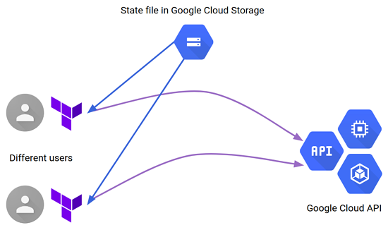

# Create a GKE Cluster with Terraform on GitLab CI/CD

## Table of Contents

* [Introduction](#introduction)

* [Getting Started](#getting-started)

* [Prerequisites](#prerequisites)

  * [Install Cloud SDK](#install-cloud-sdk)

  * [Install Terraform](#install-terraform)

  * [Cloud Project](#cloud-project)

  * [Service Account](#service-account)

  * [Service Account Key](#service-account-key)

  * [Install Kubectl](#install-kubectl)

* [Deployment](#deployment)

* [Infrastructure as Code with Terraform](#iac-terraform)

* [Versions](#versions)

* [Final] (#final)

## Introduction

This repo deploys **a GKE cluster** with **Terraform** and creates the prerequisites on **GitLab CI/CD**.

* First, **prerequisites** stage creates a [Service Account](https://cloud.google.com/iam/docs/understanding-service-accounts) named **terraform**, binds only needed IAM policies to the **Service Account** and a [Storage Bucket](https://cloud.google.com/storage/docs/json_api/v1/buckets) named **$PROJECT_ID-tf-state-bucket.**

* Then **terraform** stage plans, creates and destroys GKE cluster resources.

## Getting Started

[Kubernetes (K8s)](https://kubernetes.io/docs/concepts/overview/what-is-kubernetes/)
is an open-source system for automating deployment, scaling, and management of containerized applications. 

[Google Kubernetes Engine (GKE)](https://cloud.google.com/kubernetes-engine) provides a managed environment for deploying, managing, and scaling your containerized applications using Google infrastructure. The GKE environment consists of multiple machines (specifically, [Compute Engine](https://cloud.google.com/compute) instances) grouped together to form a [cluster](https://cloud.google.com/kubernetes-engine/docs/concepts/cluster-architecture).

[Cloud SDK](https://cloud.google.com/sdk) is tools and libraries for interacting with [Google Cloud](https://cloud.google.com/) products and services.
It is a set of command-line tools for developing with Google Cloud. You can use these tools to access Compute Engine, Cloud Storage, BigQuery, and other Google Cloud services directly from the command line.

[Kubectl](https://kubernetes.io/docs/reference/kubectl/overview/) is a command line tool for controlling Kubernetes clusters. 

[Terraform](https://www.terraform.io/intro/index.html) is an open source [“Infrastructure as Code”](https://en.wikipedia.org/wiki/Infrastructure_as_code#:~:text=Infrastructure%20as%20code%20(IaC)%20is,configuration%20or%20interactive%20configuration%20tools.) tool, created by [HashiCorp](https://www.hashicorp.com/).
It is a tool for building, changing, and versioning infrastructure safely and efficiently. It can manage existing and popular service providers as well as custom in-house solutions.

## Prerequisites

### Install Cloud SDK

[Using the Google Cloud SDK installer](https://cloud.google.com/sdk/docs/downloads-interactive)

On **Linux** & **macOS**:

```bash
curl https://sdk.cloud.google.com | bash
exec -l $SHELL
gcloud init
```

On **Windows**:

1. Download [google-cloud-sdk.zip](https://dl.google.com/dl/cloudsdk/channels/rapid/google-cloud-sdk.zip) and extract its contents. (Right click on the downloaded file and select Extract All.)

2. Launch the **google-cloud-sdk\install.bat** script and follow the installation prompts.

3. When the installation finishes, restart the command prompt (cmd.exe).

4. Run gcloud init:

```powershell
C:\> gcloud init
```

### Install Terraform

To install Terraform, find the [appropriate package](https://www.terraform.io/downloads.html) for your system and download it as a zip archive.

for macOS : https://releases.hashicorp.com/terraform/0.12.16/terraform_0.12.16_darwin_amd64.zip

for Linux (amd64) : https://releases.hashicorp.com/terraform/0.12.26/terraform_0.12.16_linux_amd64.zip

for Windows (64-bit) : https://releases.hashicorp.com/terraform/0.12.16/terraform_0.12.16_windows_amd64.zip

```bash
mv ~/Downloads/terraform /usr/local/bin/terraform
```

then check installation completed :

```bash
terraform --version                                                          
Terraform v0.12.16

Your version of Terraform is out of date! The latest version
is 0.12.26. You can update by downloading from https://www.terraform.io/downloads.html
```

### Cloud Project

You'll need create a Google Cloud Project with billing enabled.

First, login to Google Cloud.
```
gcloud auth login

You are now logged in as [xxxx.xxxx@gmail.com].
Your current project is [None].  You can change this setting by running:
  ~ gcloud config set project PROJECT_ID
```

gcloud wants we set project id but we have not a project right now. 

Let's create one.

```bash
gcloud projects create todolist-app-1 --name="todolist-app-1"  

Create in progress for [https://cloudresourcemanager.googleapis.com/v1/projects/todolist-app-1].
Waiting for [operations/cp.5815597820078033491] to finish...done.
Enabling service [cloudapis.googleapis.com] on project [todolist-app-1]...
Operation "operations/acf.6284ecb8-f761-4c48-93ec-7c6e1546b5a4" finished successfully.
```
then set project id.

```bash
gcloud config set project todolist-app-1 
```

Well, Copy the project id value and navigate following order on Gitlab

```
Your Groups 
  -> TodoListApplication 
    -> Settings 
      -> CI/CD 
        -> Variables 
          -> Expand 
            -> Add Variable
```
Enter `PROJECT` value to **Key**  and `todolist-app-1` value to **Value** input then not check **Protect variable** and **Mask variable** flags.


We need enable some [Google Cloud APIs & Services.](https://cloud.google.com/apis)

- **Identity and Access Management (IAM) API**
  - Manages identity and access control for Google Cloud Platform resources, including the creation of service accounts, which you can use to authenticate to Google and make API calls.

- **Cloud Resource Manager API**
  - Creates, reads, and updates metadata for Google Cloud Platform resource containers.

- **Cloud Billing API**
  - Allows developers to manage billing for their Google Cloud Platform projects programmatically.

```bash
gcloud services enable iam.googleapis.com
gcloud services enable cloudresourcemanager.googleapis.com
gcloud services enable cloudbilling.googleapis.com
```
The project creation completed.

Let's install alpha component for enable billing.

```bash
gcloud components install alpha
```

then list billing accounts

```bash
gcloud alpha billing accounts list

ACCOUNT_ID            NAME                OPEN  MASTER_ACCOUNT_ID
0X0X0X-0X0X0X-0X0X0X  My Billing Account  True
```

and link the created project.

```bash
gcloud alpha billing projects link todolist-app-1 \                                               
      --billing-account 0X0X0X-0X0X0X-0X0X0X

billingAccountName: billingAccounts/0X0X0X-0X0X0X-0X0X0X
billingEnabled: true
name: projects/todolist-app-1/billingInfo
projectId: todolist-app-1
```

### Service Account

We need a Service Account for using all infrastructure operations.

```bash
gcloud iam service-accounts create infra-admin --display-name infra-admin
```
then bind some roles to the Service Account.

- **Service Account Admin**
  - Create and manage service accounts. 
    - We will create two Service Accounts named **terraform** and **gke**. **terraform** named will do Terraform operations. **gke** named will be used for GKE cluster resource. 


- **Project IAM Admin**
  - Provides permissions to administer Cloud IAM policies on projects.
    - We will bind some policies to the created Service Accounts to limit these Service Accounts.

- **Service Account Key Admin**
  - Create and manage (and rotate) service account keys.
    - We need Service Account credentials to use it CI/CD pipelines.

- **Storage Admin**
  - Grants full control of objects and buckets.
    - We need create one bucket and upload some files the bucket for Terraform state management.

- **Kubernetes Engine Admin**
  - Provides access to full management of clusters and their Kubernetes API objects.
    - We need deploy applications with Helm to GKE Cluster.

```bash
gcloud projects add-iam-policy-binding todolist-app-1 \
  --member serviceAccount:infra-admin@todolist-app-1.iam.gserviceaccount.com \
  --role roles/iam.serviceAccountAdmin

gcloud projects add-iam-policy-binding todolist-app-1 \
  --member serviceAccount:infra-admin@todolist-app-1.iam.gserviceaccount.com \
  --role roles/resourcemanager.projectIamAdmin

gcloud projects add-iam-policy-binding todolist-app-1 \
  --member serviceAccount:infra-admin@todolist-app-1.iam.gserviceaccount.com \
  --role roles/iam.serviceAccountKeyAdmin

gcloud projects add-iam-policy-binding todolist-app-1 \
  --member serviceAccount:infra-admin@todolist-app-1.iam.gserviceaccount.com \
  --role roles/storage.admin

  gcloud projects add-iam-policy-binding todolist-app-1 \
  --member serviceAccount:infra-admin@todolist-app-1.iam.gserviceaccount.com \
  --role roles/container.admin

```

The Service Account creation completed.
Let's create a credential of the Service Account.

```bash
gcloud iam service-accounts keys create infra-admin-sa-credential.json \
    --iam-account=infra-admin@todolist-app-1.iam.gserviceaccount.com

created key [d70e558bbbfd127aedbbcca6042276d8d29729af] of type [json] as [infra-admin-sa-credential.json] for [infra-admin@todolist-app-1.iam.gserviceaccount.com]
````
Now, We need encrypt `infra-admin-sa-credential.json` file with **base64**.

```bash
cat infra-admin-sa-credential.json | base64                                           
ewogICJ0eXBlIjogInNlcnZpY2VfYWNjb3VudCIsCiAgInByb2plY3RfaWQiOiAidG9kb2xpc3QtdGVzdC0xIiwKICAicHJpdmF0ZV9...
```
then copy the value and navigate following order on Gitlab

```
Your Groups 
  -> TodoListApplication 
    -> Settings 
      -> CI/CD 
        -> Variables 
          -> Expand 
            -> Add Variable
```
Enter `INFRA_ADMIN_CREDENTIALS` value to **Key** and paste copied value to **Value** input then check **Protect variable** and **Mask variable** flags.

### Install kubectl

[Install and Set Up kubectl](https://kubernetes.io/docs/tasks/tools/install-kubectl/)

On **Linux**:

```bash
curl -LO "https://storage.googleapis.com/kubernetes-release/release/1.15.5/bin/linux/amd64/kubectl"
chmod +x ./kubectl
sudo mv ./kubectl /usr/local/bin/kubectl
kubectl version --client

Client Version: version.Info{Major:"1", Minor:"15", GitVersion:"v1.15.5", GitCommit:"20c265fef0741dd71a66480e35bd69f18351daea", GitTreeState:"clean", BuildDate:"2019-10-15T19:16:51Z", GoVersion:"go1.12.10", Compiler:"gc", Platform:"linux/amd64"}
```

On **macOS**:

```bash
curl -LO "https://storage.googleapis.com/kubernetes-release/release/v1.15.5/bin/darwin/amd64/kubectl"

chmod +x ./kubectl
sudo mv ./kubectl /usr/local/bin/kubectl
kubectl version --client

Client Version: version.Info{Major:"1", Minor:"15", GitVersion:"v1.15.5", GitCommit:"20c265fef0741dd71a66480e35bd69f18351daea", GitTreeState:"clean", BuildDate:"2019-10-15T19:16:51Z", GoVersion:"go1.12.10", Compiler:"gc", Platform:"darwin/amd64"}
```

on **Windows**:

```bash
curl -L0 https://storage.googleapis.com/kubernetes-release/release/v1.15.5/bin/windows/amd64/kubectl.exe
````
Add the binary in to your PATH.
```bash
kubectl version --client

Client Version: version.Info{Major:"1", Minor:"15", GitVersion:"v1.15.5", GitCommit:"20c265fef0741dd71a66480e35bd69f18351daea", GitTreeState:"clean", BuildDate:"2019-10-15T19:16:51Z", GoVersion:"go1.12.10", Compiler:"gc", Platform:"windows/amd64"}
```

### Deployment

First, go to;

```
Your Groups 
  -> TodoListApplication 
    -> Settings 
      -> CI/CD 
        -> Variables 
          -> Expand 
            -> Add Variable
```
Enter `REGION` value to **Key** and paste `europe-west6` value to **Value** input then uncheck **Protect variable** and **Mask variable** flags.

> europre-west6 (Zurich, Switzerland) is a fairly close region and it has low latency.

This repo has a pipeline. **(.gitlab-ci.yml)** 

The pipeline has two stages.

1. **prerequisites**
  - `0-create_terraform_service_account_credentials`
  - `1-create_tf_state_bucket`

2. **terraform**
  - `0-plan`
  - `1-apply`
  - `2-destroy`

#### Pipeline

It has only one docker image named `alicankustemur/gcloud-terraform`.
The docker image contains `gcloud-sdk`, `terraform`, `kubectl` and `helm` binaries.
The docker image is managed from [infrastructure/create-gcloud-terraform-docker-image](https://gitlab.com/todo-list-application/infrastructure/create-gcloud-terraform-docker-image) repository.

`.prerequisites_before_script_template` only runs on `prerequisites` stage.
It creates a infra-admin-sa-credential.json file using `INFRA_ADMIN_CREDENTIALS` variable then authenticate to gcloud and the project with this infra-admin-sa-credential.json.

`.terraform_before_script_template` only runs on `terraform` stage.
It creates a terraform-sa-credential.json file using `TERRAFORM_CREDENTIALS` variable then set `GOOGLE_APPLICATION_CREDENTIALS` variable with this terraform-sa-credential.json.

#### Create Service Account

- Go to CI/CD -> Pipelines, select `prerequisites` stage and run `0-create_terraform_service_account_credentials` job.

This will:

1. Create a Service Account **terraform**
2. Bind many roles to the Service Account [(Role List)](#role-list)
3. Create a credential key of the Service Account
4. Show the credential key as base64 encrypted

then copy the output value and navigate following order on Gitlab

```
Your Groups 
  -> TodoListApplication 
    -> Settings 
      -> CI/CD 
        -> Variables 
          -> Expand 
            -> Add Variable
```
Enter `TERRAFORM_CREDENTIALS` value to **Key** and paste copied value to **Value** input then check **Protect variable** and **Mask variable** flags.


#### Role List

| Role                            | Title                     | Description                                                                                                                       | Why                                                                                                                                                                |
|---------------------------------|---------------------------|-----------------------------------------------------------------------------------------------------------------------------------|--------------------------------------------------------------------------------------------------------------------------------------------------------------------|
| container.admin                 | Kubernetes Engine Admin   | Provides access to full management of clusters and their Kubernetes API objects.                                                  | Because We want create a GKE cluster :)                                                                                                                            |
| compute.admin                   | Compute Admin             | Full control of all Compute Engine resources.                                                                                     | GKE Clusters are created on Virtual Machines.                                                                                                                      |
| iam.serviceAccountAdmin         | Service Account Admin     | GKE Clusters are created on Virtual Machines.                                                                                     | GKE will use a Service Account. For create this one.                                                                                                               |
| iam.serviceAccountUser          | Service Account User      | Run operations as the service account.                                                                                            | If the user will be managing virtual machine instances that are configured to run as a service account, you must also grant the roles/iam.serviceAccountUser role. |
| resourcemanager.projectIamAdmin | Project IAM Admin         | Provides permissions to administer Cloud IAM policies on projects.                                                                | We only want to perform Project IAM operations.                                                                                                                    |
| serviceusage.serviceUsageAdmin  | Service Usage Admin       | Ability to enable, disable, and inspect service states, inspect operations, and consume quota and billing for a consumer project. | Enable needed APIs and services.                                                                                                                                   |
| storage.objectAdmin             | Storage Object Admin      | Grants full control of objects, including listing, creating, viewing, and deleting objects.                                       | Manage Terraform state files on Bucket.                                                                                                                            |
| iam.serviceAccountKeyAdmin      | Service Account Key Admin | Create and manage (and rotate) service account keys.                                                                              | Create a credential of Service Account **terraform** named.                                                                                                        |
| compute.publicIpAdmin           | Compute Public IP Admin   | Full control of public IP address management for Compute Engine.                                                                  | We want create two External IP for load balancers.                                                                                                                 |
| compute.securityAdmin           | Compute Security Admin    | Permissions to create, modify, and delete firewall rules and SSL certificates, and also to configure Shielded VMBETA settings.    | We need it some permissions when we create External IP.                                                                                                            |

#### Create a Storage Bucket for Terraform State Files

To work on our infrastructure with a team, we can use source control to share our infrastructure code. By default, Terraform stores the state of our infrastructure in a local state file. We could commit it with our infrastructure code, but the best practice for sharing a Terraform state when working with teams is to store it in remote storage. In our case, we will configure Terraform to store the state in a Google Cloud Storage Bucket.



- Go to this repo pipelines and `prerequisites` stage and run job `1-create_tf_state_bucket` named.

This will:

1. Create a Bucket named **todolist-app-1-tf-state** on the project.
2. Enable Bucket versioning.
3. Bind **legacyBucketWriter** IAM role to the bucket for **terraform** Service Account.

#### Terraform

**terraform** stages contains 3 jobs.

1. `0-plan` runs every time when **terraform** folder changes.
  
  - This job is information job, if it is failed, don't run `1-apply` job.

  - The [terraform plan](https://www.terraform.io/docs/commands/plan.html) command is used to create an execution plan. Terraform performs a refresh, unless explicitly disabled, and then determines what actions are necessary to achieve the desired state specified in the configuration files.

  - It download state from **todolist-app-1-tf-state** bucket and check resource states. If resources are not created, it shows: 
  ```
  Plan: 17 to add, 0 to change, 0 to destroy.
  ```
2. `1-apply` runs manual.
  
  - The [terraform apply](https://www.terraform.io/docs/commands/apply.html) command is used to apply the changes required to reach the desired state of the configuration, or the pre-determined set of actions generated by a terraform plan execution plan. We added `--auto-approve` to the apply command. The plan not works because of it.

  - It download state from **todolist-app-1-tf-state** bucket and check resource states. If resources are not created, it creates resources.

  - If you add a new Terraform `.tf` file or edit current files and run the job. It makes only new changes.


3. `2-destroy` runs manual.
  
  - The [terraform destroy](https://www.terraform.io/docs/commands/destroy.html) command is used to destroy the Terraform-managed infrastructure or the pre-determined set of actions generated by a terraform plan execution plan.
  We added `--auto-approve` to the apply command. The plan not works because of it.

  - It download state from **todolist-app-1-tf-state** bucket and check resource states. If resources are created, it removes all resources by created Terraform.

> terraform init command runs on every jobs, because every job is occurs independently of each other. It command has a `-backend-config="bucket=${BUCKET_NAME}"` flag. Because the backend values only have hard-coded, they can not variable. [open related issue](https://github.com/hashicorp/terraform/issues/13022)

## Infrastructure as Code with Terraform

### State

[for more informations](https://www.terraform.io/docs/state/index.html)

Keeping state files on cloud bucket is best practices for their management.

> `backend.tf`

```terraform
terraform {
  backend "gcs" {
  }
}
```

First initializing starts `backend.tf`, it download state from **todolist-app-1-tf-state** bucket and check resource states. Then upload changing resources to the bucket.

### Providers

Let's add following providers, because we will work on Google Cloud Platform.

> `providers.tf`

```terraform
provider "google" {
  project     = var.project
  region      = var.region 
  version     = "~> 3.23.0"
}

provider "google-beta" {
  project     = var.project
  region      = var.region 
  version     = "~> 3.23.0"
}

provider "null" {
  version = "~> 2.1.2"
}

provider "local" {
  version = "~> 1.4.0"
}
```

`null` provider needed for resources named [`null_resource`](https://www.terraform.io/docs/providers/null/resource.html).

[`local`](https://www.terraform.io/docs/providers/local/index.html) provider is used manage local resources, such as files. We will create a  `xxxx-sa-credential.json` using it.


### Resources


First, We need enable necessary APIs & Services.

> `a part of variable.tf`

```terraform
variable "services" {
    description = "Terraform needs to be authorized to communicate with following the Google Cloud APIs"
    type        = list(string)
    
    default = [
        "container.googleapis.com",
        "compute.googleapis.com",
        "servicenetworking.googleapis.com",
        "cloudresourcemanager.googleapis.com",
    ]
}
```

Terraform enables a `google_project_service` resource until number of `var.services` . 

`disable_on_destroy  = false`

Do not disable the service on destroy. On destroy, we are going to destroy the project, but we need the APIs available to destroy the underlying resources.

> `services.tf`

```terraform
resource "google_project_service" "enabled_services" {
    project = var.project
    count   = length(var.services)
    service = element(var.services, count.index)
    
    disable_on_destroy  = false
}
```

Then enabling APIs & Services, We need a [VPC (Virtual Private Network)](https://cloud.google.com/vpc) and a [Subnet](https://cloud.google.com/vpc/docs/vpc#subnets_vs_subnetworks) resources.

```terraform
depends_on = [
    google_project_service.enabled_services
  ]
``` 

The interdependent resources must be created after a dependent resources.
`vpc` resource waits for `enabled_services` resource creation.

[for more informations Terraform Resource Dependencies](https://www.terraform.io/docs/configuration/resources.html#resource-dependencies)


> `vpc.tf`

```terraform
resource "google_compute_network" "vpc" {
  depends_on = [
    google_project_service.enabled_services
  ]

  name                    = "${var.project}-vpc"
  auto_create_subnetworks = "false"
}

resource "google_compute_subnetwork" "subnet" {
  name          = "${var.project}-subnet"
  region        = var.region
  network       = google_compute_network.vpc.name
  ip_cidr_range = var.ip_cidr_range

}
```

The `var.ip_cidr_range` is `10.10.0.0/24` and it comes from `terraform.tfvars`.
Subnet resource is created with `10.10.0.0/24` CIDR range.

We need create a dedicated GKE service account for the application cluster.

> `a part of variable.tf`

```terraform
variable "gke_service_account_roles" {
    description = "List of roles to be granted to the GKE cluster."
    type        = list(string)
    
    default = [
        "roles/editor",
        "roles/storage.objectViewer"
    ]
}
```

The service account is created, binded above roles then the Service Account key is created.

1. `roles/editor`
    - It role only can change existing resources

2. `roles/storage.objectViewer`
    - It role can pull GCR images.


> `service_account.tf`

```terraform

resource "google_service_account" "gke" {
    account_id   = "${var.project}-gke"
    display_name = "${var.project}-gke"
    project      = var.project
}

resource "google_service_account_key" "gke" {
    service_account_id = google_service_account.gke.name
    public_key_type    = "TYPE_X509_PEM_FILE"
}

resource "google_project_iam_member" "gke" {
    count   = length(var.gke_service_account_roles)
    project = var.project
    role    = element(var.gke_service_account_roles, count.index)
    member  = format("serviceAccount:%s", google_service_account.gke.email)
}
```

`google_container_cluster` is a GKE cluster resource.

It has 1 `initial_node_count` and node pool `node_count`.

We can't create a cluster with no node pool defined, but we want to only use
separately managed node pools. So we create the smallest possible default
node pool and immediately delete it. We set `remove_default_node_pool = true`  because of this.

```
min_master_version = data.google_container_engine_versions.gke_version.latest_master_version
```
`min_master_version` uses above data source. 
`data.google_container_engine_versions.gke_version.latest_master_version` comes from `versions.tf`

It pulls latest GKE version from specified region.

then bind what we have created VPC and Subnet resources before.

`master_auth` variables are empty, it means basic authentication is false. 

```json
client_certificate_config {
      issue_client_certificate = false
    }
```

then turn off certificate authorization with `issue_client_certificate = false`


`google_container_node_pool` is a Node Pool resource.

A node pool is a group of nodes within a cluster that all have the same configuration. All nodes have `n1-standard-1` machine type.

We bind the Service Account named `gke` we created before.


> `gke.tf`

```terraform
resource "google_container_cluster" "primary" {
  name     = "gke"
  location = var.region

  remove_default_node_pool = true
  initial_node_count       = var.initial_node_count

  min_master_version = data.google_container_engine_versions.gke_version.latest_master_version

  network     = google_compute_network.vpc.name
  subnetwork  = google_compute_subnetwork.subnet.name

  master_auth {
    username = ""
    password = ""

    client_certificate_config {
      issue_client_certificate = false
    }
  }
}

resource "google_container_node_pool" "primary_nodes" {
  name       = "${google_container_cluster.primary.name}-node-pool"
  location   = var.region
  cluster    = google_container_cluster.primary.name
  node_count = var.node_count

  node_config {
    service_account = google_service_account.gke.email

    oauth_scopes = [
      "https://www.googleapis.com/auth/logging.write",
      "https://www.googleapis.com/auth/monitoring",
    ]

    labels = {
      env = var.project
    }

    machine_type = var.machine_type
    tags         = ["gke-node", "${var.project}-gke"]
    metadata = {
      disable-legacy-endpoints = "true"
    }
  }
}
```

> `a part of version.tf`

```terraform
data "google_container_engine_versions" "gke_version" {
  depends_on = [google_project_service.enabled_services]

  project  = var.project
  location = var.region
}
```

The **External IPs** will use for **Kubernetes Service Load Balancer** types.


> `external_ip.tf`

```terraform
resource "google_compute_address" "back_end" {
    name = "back-end"
}

resource "google_compute_address" "front_end" {
    name = "front-end"
}
```

`get_credentials` resource makes `gcloud auth` and `KUBECONFIG`.

It runs on GitLab `terraform` jobs container's local terminal.

The following stuff is a trick for always run.
```json
triggers = {
        always_run = "${timestamp()}"
    }
````

`service_account_key_json` resource creates a credential json for created the **Service Account** named `gke`.

`enable_pull_gcr_images` resource creates a [**Kubernetes Secret Object**](https://kubernetes.io/docs/concepts/configuration/secret/) typed `kubernetes.io/dockerconfigjson` then patch `default` [**Kubernetes Service Account**](https://kubernetes.io/docs/reference/access-authn-authz/service-accounts-admin/).


> `null_resource.tf`

```terraform
resource "null_resource" "get_credentials" {
    depends_on = [google_container_cluster.primary]

    triggers = {
        always_run = "${timestamp()}"
    }

    provisioner "local-exec" {
        command = <<EOT
            gcloud auth activate-service-account --key-file="$GOOGLE_APPLICATION_CREDENTIALS" --project=${var.project}
            gcloud config set core/project ${var.project} 
            gcloud config set compute/region ${var.region}
            gcloud config set compute/region ${var.region}
            gcloud container clusters get-credentials ${google_container_cluster.primary.name} --region ${var.region}
        EOT
    }
}

resource "local_file" "service_account_key_json" {
    content  = base64decode(google_service_account_key.gke.private_key)
    filename = "${path.module}/${google_service_account.gke.account_id}.json"
}

resource "null_resource" "enable_pull_gcr_images" {
    depends_on = [null_resource.get_credentials]
    
    triggers = {
        always_run = "${timestamp()}"
    }

    provisioner "local-exec" {
        command = <<EOT
            kubectl create secret docker-registry ${google_service_account.gke.account_id} \
                --docker-server=https://eu.gcr.io \
                --docker-username=_json_key \
                --docker-email=user@example.com \
                --docker-password="$(cat ${path.module}/${google_service_account.gke.account_id}.json )"
            
            kubectl patch serviceaccount default \
                -p "{\"imagePullSecrets\": [{\"name\": \"${google_service_account.gke.account_id}\"}]}"
        EOT
    }
}
```

In variable definitions (`.tfvars`) files, either specified on the command line or automatically loaded.

> `terraform.tfvars`

```terraform
machine_type= "n1-standard-1"
ip_cidr_range = "10.10.0.0/24"
initial_node_count = 1
node_count = 1
```

To constrain the provider version as suggested, add a **required_providers** block inside a terraform block.
so the version will be enforce to use.

> `a part of version.tf`

```terraform
terraform {
  required_version = ">= 0.12"
}
```

It gives defined outputs.

> `outputs.tf`

```terraform
output "cluster_name" {
    value = google_container_cluster.primary.name
}

output "back_end_external_ip" {
    value = google_compute_address.back_end.address
}

output "front_end_external_ip" {
    value = google_compute_address.front_end.address
}
```

- If the `1-apply` job runs succeeded gives three outputs.

```
Outputs:
backend_external_ip = 34.65.248.48
cluster_name = gke
frontend_external_ip = 34.65.182.235
```

then copy the output values `backend_external_ip`, `frontend_external_ip`   and navigate following order on Gitlab

```
Your Groups 
  -> TodoListApplication 
    -> Settings 
      -> CI/CD 
        -> Variables 
          -> Expand 
            -> Add Variable
```

Enter `BACKEND_EXTERNAL_IP` value to **Key** and paste copied value to **Value** input then uncheck **Protect variable** and **Mask variable** flags.

Enter `FRONTEND_EXTERNAL_IP` value to **Key** and paste copied value to **Value** input then uncheck **Protect variable** and **Mask variable** flags.

## Versions

Versions

---

- Terraform v0.12.16
- Kubernetes (GKE) v1.16.9-gke.2
- kubectl v1.15.5
- Google Cloud SDK 294.0.0
  - alpha 2019.05.17
  - beta 2019.05.17
  - bq 2.0.57
  - core 2020.05.21
  - gsutil 4.51

Tested on

---

- macOs Catalina 10.15.4

# Final

Let's login to Kubernetes Cluster.

```bash
gcloud auth login
gcloud container clusters get-credentials gke --region europe-west6

Fetching cluster endpoint and auth data.
kubeconfig entry generated for gke.

kubectl get pods --all-namespaces 


NAMESPACE     NAME                                                        READY   STATUS    RESTARTS   AGE
kube-system   event-exporter-gke-6c56555957-fddln                         2/2     Running   0          53m
kube-system   fluentd-gke-7kgw4                                           2/2     Running   0          49m
kube-system   fluentd-gke-scaler-cd4d654d7-754v6                          1/1     Running   0          53m
kube-system   fluentd-gke-tn9bc                                           2/2     Running   3          49m
kube-system   fluentd-gke-vtwt5                                           2/2     Running   1          49m
kube-system   gke-metrics-agent-849q5                                     1/1     Running   0          49m
kube-system   gke-metrics-agent-dzc9d                                     1/1     Running   0          49m
kube-system   gke-metrics-agent-kxtz4                                     1/1     Running   0          49m
kube-system   kube-dns-5c9ff9fc54-mhx82                                   4/4     Running   0          53m
kube-system   kube-dns-5c9ff9fc54-nk8n8                                   4/4     Running   0          49m
kube-system   kube-dns-autoscaler-645f7d66cf-cvlrb                        1/1     Running   0          53m
kube-system   kube-proxy-gke-gke-gke-node-pool-0228a416-n852              1/1     Running   0          49m
kube-system   kube-proxy-gke-gke-gke-node-pool-730284fe-hzkt              1/1     Running   0          49m
kube-system   kube-proxy-gke-gke-gke-node-pool-e3d1fe15-3dpg              1/1     Running   0          49m
kube-system   l7-default-backend-678889f899-2np57                         1/1     Running   0          53m
kube-system   metrics-server-v0.3.6-7b7d6c7576-6v947                      2/2     Running   0          53m
kube-system   prometheus-to-sd-fl7kl                                      1/1     Running   0          49m
kube-system   prometheus-to-sd-gzl6x                                      1/1     Running   0          49m
kube-system   prometheus-to-sd-xp4m4                                      1/1     Running   0          49m
kube-system   stackdriver-metadata-agent-cluster-level-79f667d5c9-7cnjs   2/2     Running   0          48m

kubectl get nodes                                                                                                                                     

NAME                                  STATUS   ROLES    AGE   VERSION
gke-gke-gke-node-pool-0228a416-n852   Ready    <none>   49m   v1.16.9-gke.2
gke-gke-gke-node-pool-730284fe-hzkt   Ready    <none>   49m   v1.16.9-gke.2
gke-gke-gke-node-pool-e3d1fe15-3dpg   Ready    <none>   49m   v1.16.9-gke.2
```

🎉 Finally, **GKE Cluster** is ready.


